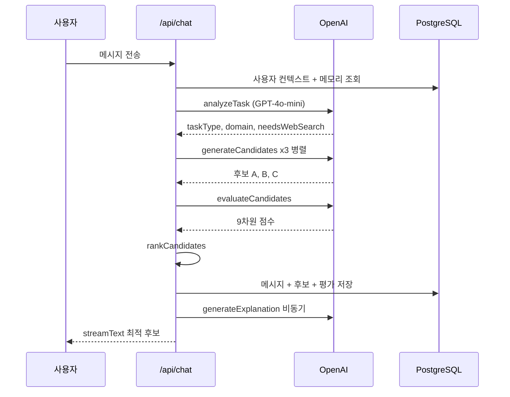
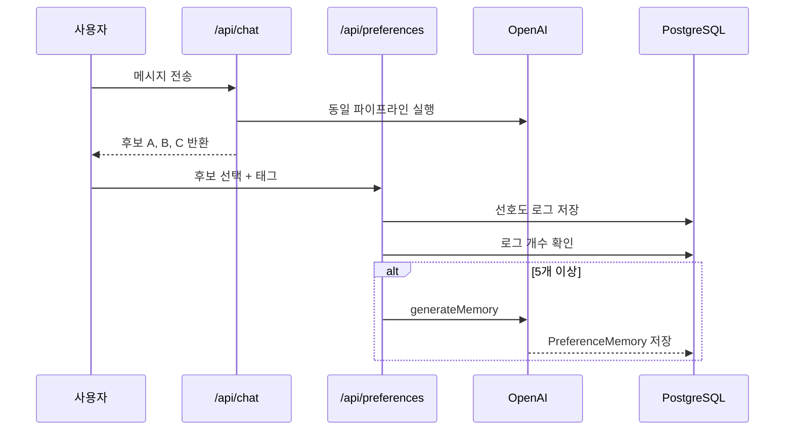

# Personalized AI Assistant

<div align="center">

**"기존 AI는 사용자를 기억합니다.**
**Personalized AI Assistant는 사용자의 선택을 학습합니다."**

사용자의 선택을 학습하여 응답 전략을 지속적으로 개선하는 **AI Experience System**

| ✔ Preference Learning | ✔ Response Evaluation | ✔ Prompt Orchestration |
|:---:|:---:|:---:|
| ✔ Explainable AI (XAI) | ✔ Persona Routing | ✔ Long-term Memory |

**[데모 보기](https://frontend-mu-liard-59.vercel.app)**

</div>

---

<!-- 📸 대표 GIF 추가 예정 -->
<!-- Learning Mode에서 후보 3개를 선택하고, Normal Mode에서 개인화된 응답이 스트리밍되는 장면 -->

---

- AI가 스스로 기억하는 것이 아니라, 사용자의 **선택 행동을 학습**합니다.
- 3개의 응답 후보 중 하나를 선택할 때마다 AI의 응답 전략이 바뀝니다.
- 말하지 않아도 AI가 먼저 맞춰갑니다.

---

## Design Principles

이 프로젝트를 설계하면서 지킨 다섯 가지 원칙입니다.

**1. 사용자의 선택을 학습 신호로 사용한다.**
Custom Instructions처럼 사용자가 직접 설정하지 않아도 된다. 선택 행동 자체가 데이터다.

**2. 응답 생성보다 응답 평가를 중요하게 생각한다.**
하나의 응답을 만드는 것보다 여러 응답 중 더 나은 것을 판단하는 시스템이 더 어렵고 더 중요하다.

**3. 개인화는 정보 저장이 아니라 행동 변화다.**
"나는 개발자야"를 기억하는 것과 코드 예제 중심으로 응답 전략이 바뀌는 것은 다르다.

**4. 모든 AI 의사결정은 설명 가능해야 한다.**
왜 이 응답이 선택되었는지 사용자가 알 수 있어야 시스템을 신뢰할 수 있다.

**5. AI는 사용자에게 적응해야 한다.**
사용자가 AI에 맞추는 것이 아니라, AI가 사용자에게 맞추는 방향으로 설계한다.

---

## Why

ChatGPT나 Claude를 오래 쓰다 보면 이상한 점을 느끼게 됩니다.

내가 개발자라는 사실은 기억합니다. 하지만 내가 코드 예제를 좋아하는지, 이론 설명을 좋아하는지는 학습하지 않습니다. 내가 짧은 답을 원하는지, 긴 설명을 원하는지도 바뀌지 않습니다.

**기존 AI는 정보를 기억합니다. 이 프로젝트는 행동을 학습합니다.**

사용자가 3개의 응답 후보 중 하나를 선택할 때, 그 선택은 단순한 클릭이 아닙니다. 선택된 응답의 전략, 길이, 어조, 구조가 다음 대화의 출발점이 됩니다. 말하지 않아도 AI가 맞춰갑니다.

이 차이를 만드는 것이 이 프로젝트의 목표였습니다.

---

## 핵심 아이디어

**사용자의 선택이 AI를 학습시킨다.**

```
[학습 모드]                          [일반 모드]

질문 입력                            질문 입력
    │                                    │
    ▼                                    ▼
AI가 3가지 전략으로                  학습된 선호도 기반으로
응답 후보 제안                       자동으로 최적 응답 스트리밍
    │                                    │
    ▼                                    ▼
사용자가 응답 선택                   "코드로 보여줘"라고
    │                                말하지 않아도 됨
    ▼
선택이 선호도 데이터로 저장
    │
    ▼
LLM이 누적 데이터 분석 후
자연어 프로파일 생성
    │
    ▼
다음 대화 프롬프트에 주입
```

5번 선택하면 패턴이 생깁니다. 10번 선택하면 AI가 먼저 맞춥니다.

이것은 RLHF(Reinforcement Learning from Human Feedback)의 핵심 개념을 프로덕션 수준에서 단순화한 구조입니다. 사람의 선택이 학습 신호가 됩니다.

---

<!-- 📸 Learning Mode GIF 추가 예정 -->
<!-- 후보 3개가 펼쳐지고, 사용자가 선택하는 장면 -->

---

## 프로젝트 규모

| 항목 | 수치 |
|------|------|
| Task Types | 13가지 |
| Default Personas | 5가지 |
| Evaluation Dimensions | 9차원 |
| Candidate Strategies | 3가지 |
| LangGraph Nodes | 12개 |
| API Routes | 10개 이상 |
| LLM Providers | 4가지 (OpenAI / Anthropic / Google / Mock) |

---

## Trade-offs

설계하면서 내린 주요 결정들입니다. 기능을 추가하거나 제거한 이유를 먼저 이해하면 전체 구조가 더 잘 보입니다.

**18차원에서 9차원으로**

설계 단계에서 18차원 루브릭을 만들었습니다. 자연스러움, 문법 정확성, 사실 정확성, 환각 위험도 등을 포함했습니다.

문제가 있었습니다. LLM에게 "이 응답이 사실적으로 정확한가?"를 묻는 것은 같은 LLM이 생성한 응답을 같은 LLM이 검증하는 구조입니다. 신뢰 있게 측정할 수 없는 차원을 루브릭에 넣는 것은 정확도를 높이는 게 아니라 노이즈를 추가하는 것입니다. 측정 가능한 9개 차원만 남겼습니다.

**LangGraph를 독립 서버로 설계한 이유**

Vercel 서버리스 환경은 Python 런타임을 지원하지 않습니다. 선택지는 두 가지였습니다. LangGraph를 포기하거나, 독립 서버로 배포 가능한 구조를 유지하거나.

LangGraph의 가치는 AI 파이프라인을 StateGraph로 명시적으로 설계하는 데 있습니다. 실행 환경보다 설계 방식이 핵심입니다. Next.js 파이프라인이 같은 StateGraph 구조를 미러링하고, Python 백엔드는 Railway나 Render에 독립 배포 가능한 구조로 유지했습니다.

**Mock Provider를 만든 이유**

개발 중 LLM API를 매번 호출하면 비용이 발생합니다. 더 큰 문제는 네트워크 지연으로 개발 사이클이 느려진다는 것입니다. Mock Provider는 규칙 기반으로 즉시 응답을 반환합니다. 환경 변수 하나(`LLM_PROVIDER=mock`)로 전환됩니다.

**Learning Mode가 필요한 이유**

Normal Mode만 있으면 사용자 피드백을 수집할 방법이 없습니다. 사용자가 응답에 불만족해도 시스템은 알지 못합니다. Learning Mode는 선택을 명시적 피드백으로 만드는 데이터 수집 인터페이스입니다.

**A/B Experiment를 만든 이유**

두 개의 시스템 프롬프트 중 어떤 것이 더 나은지 직관으로 판단하는 대신, 같은 입력에 두 프롬프트를 실행하고 9차원 평가로 승자를 결정합니다. 승자 프롬프트는 이후 실제 채팅에 자동 반영됩니다.

---

## System Architecture

```mermaid
flowchart TD
    A[사용자 메시지] --> B[/api/chat]
    B --> C[resolveUserContext]
    C --> D[getMemory]
    D --> E[analyzeTask]
    E --> F{needsWebSearch?}
    F -->|Yes| G[Web Search\nTavily / OpenAI]
    F -->|No| H[resolvePersonaForTask]
    G --> H
    H --> I[buildSystemPrompt\n메모리 + 페르소나 + 검색 + 온보딩]
    I --> J[getWinningSystemPrompt\nA/B 실험 승자 주입]
    J --> K[generateCandidates\n3개 병렬 생성]
    K --> L[evaluateCandidates\n9차원 평가]
    L --> M[rankCandidates\n점수 + 메모리 가중치]
    M --> N{mode?}
    N -->|LEARNING| O[후보 3개 반환]
    N -->|NORMAL| P[streamText\n최적 후보 스트리밍]
    O --> Q[사용자 선택]
    Q --> R[/api/preferences\n로그 저장]
    R --> S[generateMemory\nLLM 합성]
    P --> T[generateExplanation\nXAI 저장]
    T --> U[detectSuggestions\n비동기]
```

```
┌─────────────────────────────────────────────────────────┐
│                        Browser                          │
│      useChat (Vercel AI SDK)  --  streaming response    │
└────────────────────────┬────────────────────────────────┘
                         │ HTTP / SSE
┌────────────────────────▼────────────────────────────────┐
│             Next.js 15 App Router (Vercel)              │
│                                                         │
│  /api/chat                핵심 오케스트레이터            │
│  /api/preferences         선호도 로그                    │
│  /api/memory              메모리 CRUD                    │
│  /api/personas            페르소나 관리                  │
│  /api/explanation         XAI 데이터                    │
│  /api/suggestions         적응형 제안                    │
│  /api/prompt-experiments  A/B 실험                      │
│  /api/cron/global-learning  전역 학습 Cron              │
└────────────────────────┬────────────────────────────────┘
                         │
          ┌──────────────┼──────────────┐
          │              │              │
┌─────────▼──────┐ ┌─────▼─────┐ ┌────▼──────────┐
│  OpenAI API    │ │  Tavily   │ │  PostgreSQL   │
│  GPT-4o-mini   │ │  Search   │ │  (Neon)       │
└────────────────┘ └───────────┘ └───────────────┘

┌─────────────────────────────────────────────────────────┐
│          Python FastAPI + LangGraph (독립 서버)          │
│   12노드 StateGraph -- Railway / Render 배포 가능       │
└─────────────────────────────────────────────────────────┘
```

---

## Core Experience Systems

### 1. Task Analyzer

**Why**

"파이썬 코드 알려줘"와 "파이썬 역사 알려줘"는 다른 방식으로 처리해야 합니다. 페르소나 선택, 웹 검색 실행 여부, 후보 생성 전략이 모두 여기서 갈립니다.

**How**

GPT-4o-mini로 질문을 분류합니다. 13가지 태스크 유형, 복잡도, 도메인, 웹 검색 필요 여부를 하나의 JSON으로 반환합니다.

```
입력: "Next.js에서 ISR 캐시 무효화하는 방법"
출력: {
  taskType: "PROGRAMMING",
  complexity: "MODERATE",
  domain: "software",
  needsWebSearch: false,
  preferredStyle: "code-first"
}
```

**Trade-off**

LLM 호출 비용이 발생하지만 규칙 기반으로는 분류 정확도 확보가 어렵습니다. 응답 실패 시 GENERAL 폴백으로 처리합니다.

---

### 2. Candidate Generator

**Why**

하나의 응답만 생성하면 그게 최선인지 알 수 없습니다. 다른 전략으로 생성한 응답을 평가하고 선택하기 위해 3개를 만듭니다.

**How**

동일한 시스템 프롬프트에 전략 힌트를 다르게 주어 3개의 응답을 병렬로 생성합니다.

| 전략 | 특성 |
|------|------|
| STRUCTURED | 헤더, 목록, 단계 구분 |
| CONCISE | 핵심만, 짧게 |
| PROFESSIONAL | 형식적, 정확한 |
| ANALYTICAL | 원인 결과 분석 |
| CONVERSATIONAL | 자연스러운 대화체 |

**Trade-off**

API 호출이 3배입니다. 병렬 처리로 지연을 최소화했습니다. Learning Mode에서 이 비용이 의미 있는 학습 데이터를 만듭니다.

---

### 3. Evaluation Engine

**Why**

3개 중 어떤 응답이 더 나은지 판단하는 기준이 필요합니다. 주관적 판단을 수치로 만들기 위해 평가 루브릭을 설계했습니다.

**How**

9개 차원으로 0에서 1 사이 점수를 매깁니다.

| 차원 | 설명 |
|------|------|
| instructionFollowing | 질문을 정확히 따랐는가 |
| clarity | 이해하기 쉬운가 |
| structure | 논리적으로 구조화되었는가 |
| completeness | 필요한 내용이 빠지지 않았는가 |
| specificity | 구체적인가, 모호하지 않은가 |
| readability | 읽기 편한가 |
| formatting | 마크다운 형식이 적절한가 |
| preferenceMatch | 사용자 선호도와 맞는가 |
| safety | 안전한 내용인가 |

---

### 4. Ranker

**Why**

평가 점수만으로 랭킹을 정하면 사용자 개인의 선호가 반영되지 않습니다. 객관적 품질과 개인 선호를 합산하는 방식이 필요했습니다.

**How**

```
최종 점수 = 평가 점수 + 선호도 메모리 가중치
```

메모리에 "STRUCTURED 전략 선호"가 기록되어 있으면 해당 전략 후보에 가중치가 추가됩니다. 같은 품질이면 사용자가 과거에 더 많이 선택한 전략이 이깁니다.

---

### 5. Preference Memory

**Why**

선호도 로그를 그대로 프롬프트에 넣으면 토큰 낭비가 심합니다. LLM이 로그를 분석해 자연어 요약으로 압축하면 그대로 시스템 프롬프트에 주입할 수 있습니다.

**How**

선호도 로그가 5개 이상 쌓이면 LLM이 전체 로그를 읽고 프로파일을 합성합니다.

```
입력: 최근 선호도 로그 50개

출력: {
  preferredTone: "casual",
  preferredLength: "concise",
  preferredStrategies: ["STRUCTURED", "CONCISE"],
  rawSummary: "코드 예제 중심, 이론 설명 최소화, 단계별 구조를 선호"
}
```

이 요약이 다음 대화의 시스템 프롬프트에 주입됩니다.

---

### 6. Persona System

**Why**

같은 사람도 질문 유형에 따라 원하는 응답 스타일이 다릅니다. 기술 질문에는 코드 중심, 면접 준비에는 코칭 스타일, 리서치에는 학술적 분석이 맞습니다.

**How**

5개의 기본 페르소나를 사전 정의했습니다.

| 페르소나 | 활성화 조건 |
|----------|------------|
| Developer Mentor | PROGRAMMING, DEBUGGING, CODE_REVIEW |
| Interview Coach | CAREER, INTERVIEW |
| Research Assistant | RESEARCH, ANALYSIS |
| Friendly Mentor | LEARNING, EDUCATION |
| Professional Assistant | WRITING, PLANNING, TRANSLATION |

Task Analyzer의 domain과 taskType을 기반으로 자동 매칭합니다. 사용자가 직접 선택하면 자동 매칭보다 우선합니다.

---

### 7. XAI (Explainable AI)

**Why**

AI가 왜 이 응답을 선택했는지 알 수 없으면 시스템을 신뢰하기 어렵습니다.

**How**

응답 생성 직후 별도로 설명 데이터를 저장합니다.

- 어떤 메모리가 이 응답에 영향을 미쳤는가
- 어떤 페르소나가 활성화되었는가
- 각 후보의 점수는 얼마였는가
- 이 응답이 선택된 이유는 무엇인가

<!-- 📸 XAI 패널 스크린샷 추가 예정 -->

---

### 8. Adaptive Suggestion

**Why**

사용자가 계속 같은 태그를 선택하고 있다면, 시스템이 먼저 "이 설정을 기본값으로 바꾸는 게 어떨까요?"라고 제안할 수 있어야 합니다.

**How**

채팅 응답 후 비동기로 실행됩니다. 최근 로그 20개를 분석해 반복 패턴을 감지하면 제안 배너를 생성합니다. 응답 흐름과 완전히 분리되어 스트리밍 속도에 영향을 주지 않습니다.

---

### 9. Global Learning

**Why**

새 사용자는 선호도 데이터가 없습니다. 개인 메모리가 쌓이기 전까지 전체 사용자의 패턴을 활용합니다.

**How**

Vercel Cron이 매일 새벽 3시에 실행됩니다. 모든 사용자의 선호도 로그를 집계하여 어떤 전략이 어떤 태스크 유형에서 선호되는지를 전역 메모리로 합성합니다.

---

### 10. LangGraph Backend

**Why**

AI 파이프라인의 각 단계를 함수 호출로 연결하는 대신, StateGraph로 명시적으로 모델링하면 흐름이 시각화되고 확장이 쉬워집니다.

**How**

Python FastAPI + LangGraph 0.2로 12노드 파이프라인을 구현했습니다.

```
task_analyzer_node
    │
    ├── (needsSearch) search_node
    │
candidate_generator_node  (ThreadPoolExecutor로 병렬)
    │
evaluation_node
    │
ranking_node
    │
response_formatter_node
```

각 노드는 OpenAI 실제 호출과 규칙 기반 폴백을 모두 구현했습니다. Vercel 서버리스 환경에서 Python 서버를 실행할 수 없어 독립 서버 구조로 설계했습니다. Next.js 파이프라인이 같은 StateGraph 구조를 미러링합니다.

---

## Data Flow

### Normal Mode



### Learning Mode



---

## Challenges

**userId 해결**

같은 사용자가 로그인 상태와 비로그인 상태를 오갈 때 선호도 데이터가 분리됩니다. NextAuth 세션, 쿠키 기반 세션 ID, anonymous 폴백을 3단계로 처리하는 `resolveUserContext()`를 구현했습니다.

**스트리밍 중 사이드이펙트 처리**

응답을 스트리밍하면서 DB 저장, XAI 생성, 적응형 제안 탐지를 동시에 실행해야 했습니다. 이 작업들을 응답 흐름과 분리하고 비동기로 처리하여 스트리밍 지연을 없앴습니다.

**SQLite JSON 직렬화 (개발 환경)**

Prisma가 SQLite에서 배열 타입을 지원하지 않습니다. `preferredStrategies`, `allowedBehaviors` 같은 배열 필드를 모두 `JSON.stringify()`로 저장하고 `JSON.parse()`로 읽어야 합니다. 이 패턴을 잊으면 런타임에 문자열이 배열처럼 순회되는 버그가 생깁니다.

**LLM 평가의 신뢰도**

LLM에게 LLM 응답을 평가하게 하면 편향이 생깁니다. 평가 모델이 생성 모델과 같으면 자기 자신의 스타일을 더 높게 평가할 수 있습니다. 사용자의 실제 선택 데이터로 평가 결과를 보정하는 방식으로 보완합니다.

---

## Technical Decisions

**Next.js 15 App Router**

API Routes, 스트리밍, SSR, 정적 페이지를 하나의 프레임워크에서 처리합니다. 별도 Express 서버 없이 `/api/chat`이 AI 파이프라인의 핵심 오케스트레이터 역할을 합니다.

**Vercel AI SDK**

`streamText`와 `useChat`의 조합으로 스트리밍 구현 복잡도를 낮췄습니다. 이 SDK 없이는 SSE 처리, 청크 파싱, 클라이언트 상태 관리를 모두 직접 구현해야 했습니다.

**Prisma + PostgreSQL (Neon)**

Prisma가 TypeScript 타입을 자동 생성합니다. DB 스키마와 코드가 항상 동기화됩니다. Neon은 서버리스 환경에서 커넥션 풀링을 PgBouncer로 처리합니다.

**OpenAI GPT-4o-mini**

태스크 분석, 후보 생성, 평가, 메모리 합성 전 단계에서 같은 모델을 사용합니다. LLM 프로바이더 추상화로 OpenAI, Anthropic, Google 전환이 환경 변수 하나로 가능합니다.

**LangGraph**

AI 파이프라인을 함수 호출 체인이 아닌 명시적 그래프로 설계했습니다. 조건부 엣지로 분기 흐름이 코드가 아닌 그래프에 드러납니다.

---

## Future Work

**Fine-tuning Pipeline**

현재 Preference Memory는 선호도 로그를 LLM 프롬프트로 주입합니다. 충분한 데이터가 쌓이면 이 데이터를 DPO 형식으로 변환하여 실제 파인튜닝에 사용할 수 있습니다. 데이터셋 내보내기 기능이 이 파이프라인의 출발점입니다.

**Cold Start 해결**

새 사용자는 선호도 데이터가 없습니다. 가입 시 간단한 온보딩 질문으로 초기 선호도를 설정하거나, 유사 사용자의 패턴을 활용하는 협업 필터링을 도입할 수 있습니다.

**LangGraph 프로덕션 배포**

Python FastAPI + LangGraph 백엔드를 Railway나 Render에 배포하면 실제 멀티에이전트 오케스트레이션이 프로덕션에서 실행됩니다. Persistence(MemorySaver)를 추가하면 대화 중간에 상태를 저장하고 재개할 수 있습니다.

---

## What I Learned

**AI Experience는 기능이 아니라 설계다**

처음에는 LLM API를 호출해 응답을 반환하는 것이 전부라고 생각했습니다. 실제로 만들면서 응답 품질보다 사용자가 응답을 어떻게 경험하는지가 더 중요하다는 것을 배웠습니다. 스트리밍 속도, 후보 선택 UI, XAI 투명성이 모두 AI Experience의 일부입니다.

**프롬프트 엔지니어링은 코드다**

프롬프트는 텍스트가 아닙니다. 메모리, 페르소나, 태스크 컨텍스트, 검색 결과, 온보딩 지시사항이 합쳐지는 조립 시스템입니다. 어떤 순서로 어떤 정보를 넣느냐에 따라 응답 품질이 달라집니다.

**평가를 설계하는 것이 어렵다**

"좋은 응답"을 정의하는 것 자체가 문제입니다. 객관적 품질 기준과 주관적 선호가 충돌합니다. 18차원에서 9차원으로 줄인 과정이 이 문제를 직접 경험한 결과입니다.

**좋은 AI는 더 많은 기능을 추가하는 것이 아니라, 사용자의 행동을 더 나은 경험으로 연결하는 시스템을 설계하는 것이라는 점을 배웠습니다.**

---

## Stack

| 영역 | 기술 |
|------|------|
| Framework | Next.js 15 App Router |
| Language | TypeScript 5 |
| AI SDK | Vercel AI SDK v4 |
| LLM | OpenAI GPT-4o-mini |
| ORM | Prisma 5 |
| Database | PostgreSQL (Neon) |
| Auth | NextAuth.js |
| State | Zustand |
| Server State | TanStack Query |
| Styling | Tailwind CSS |
| Charts | Recharts |
| Agent Graph | LangGraph 0.2 (Python) |
| Backend | FastAPI |
| Deployment | Vercel |
