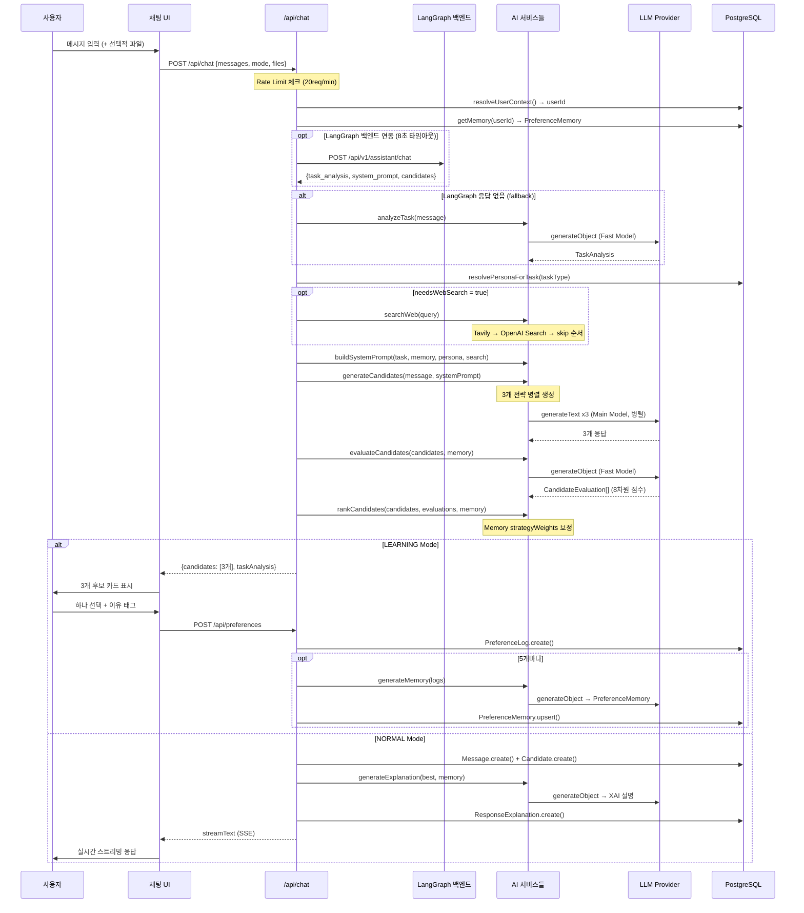
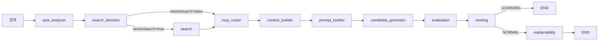

# 03 시스템 흐름 (System Flow)

## 전체 요청-응답 흐름



---

## 단계별 상세 설명

### Step 1: 사용자 요청 수신

클라이언트에서 `POST /api/chat`으로 다음 데이터를 전송합니다.

```typescript
{
  messages: Array<{ role: string; content: string }>,
  conversationId?: string,    // 기존 대화 이어가기
  mode: 'NORMAL' | 'LEARNING',
  files?: AttachedFile[]      // 이미지/텍스트/PDF
}
```

파일은 클라이언트에서 base64로 인코딩 후 전송됩니다. 서버에서 PDF는 `pdf-parse`로 텍스트를 추출하고 이미지는 Vision API에 직접 전달합니다.

### Step 2: 사용자 컨텍스트 해석

`resolveUserContext()`는 세 가지 방법으로 userId를 결정합니다.

```
1순위: NextAuth JWT 세션 → 로그인 사용자 userId
2순위: 쿠키의 aai_session → 익명 사용자 고유 ID
3순위: 'anonymous' (쿠키도 없는 경우)
```

이 설계로 로그인 없이도 사용 가능하고, 로그인 시 익명 데이터를 계정으로 이전합니다.

### Step 3: LangGraph 백엔드 선택적 연동

```typescript
const LANGGRAPH_URL = process.env.LANGGRAPH_BACKEND_URL ?? 'http://localhost:8000'
// 8초 타임아웃 AbortController
// 성공: 백엔드의 task_analysis, system_prompt, candidates 사용
// 실패/타임아웃: 로컬 파이프라인으로 fallback
```

### Step 4: Task Analysis (태스크 분석)

`analyzeTask()`가 LLM에게 사용자 메시지를 분석시킵니다.

```typescript
// 출력 (Zod 스키마로 타입 보장)
{
  taskType: 'PROGRAMMING' | 'RESEARCH' | ... (16가지),
  complexity: 'LOW' | 'MEDIUM' | 'HIGH',
  domain: 'technology' | 'business' | ...,
  needsWebSearch: boolean,    // 최신 정보 필요 여부
  preferredStyle: 'concise' | 'structured' | ...,
  confidence: number (0-1)
}
```

`needsWebSearch=true` 조건: "요즘", "최근", "지금", "latest", "current" 등의 시간성 키워드가 포함되거나 가격, 순위, 날씨 등 실시간 정보 질문.

### Step 5: 페르소나 자동 선택

```typescript
// 태스크 유형 → 기본 페르소나 자동 매핑
const TASK_PERSONA_MAP = {
  PROGRAMMING: 'Developer Mentor',
  CAREER: 'Interview Coach',
  INTERVIEW: 'Interview Coach',
  RESEARCH: 'Research Assistant',
  LEARNING: 'Friendly Mentor',
  WRITING: 'Professional Assistant',
}
// 사용자가 직접 활성화한 페르소나가 있으면 항상 그것이 우선
```

### Step 6: 웹 검색 (조건부)

`needsWebSearch=true`이고 백엔드 fallback 상태일 때만 실행됩니다.

```
검색 우선순위:
1. Tavily API (TAVILY_API_KEY 있을 때) — 고품질 웹 검색
2. OpenAI Search (OPENAI_API_KEY 있을 때) — OpenAI 내장 검색
3. 없으면 스킵
```

검색 결과는 `buildSearchContext()`로 포맷팅되어 시스템 프롬프트에 주입됩니다.

### Step 7: 프롬프트 조립

`buildSystemPrompt()`가 우선순위에 따라 컴포넌트를 결합합니다.

```
Persona Fragment          (최우선: 페르소나 정의)
+ User Profile Context    (이름, 직업, 관심사, 목표)
+ Flow Context            (활성 대화 흐름 지침)
+ Task Context            (유형, 복잡도, 스타일)
+ Memory Context          (선호 톤, 길이, 구조, 전략)
+ Global Memory Context   (전체 사용자 패턴 인사이트)
+ Recent Summaries        (최근 대화 3개 요약)
+ Examples Context        (과거 고품질 응답 예시)
+ Search Context          (웹 검색 결과)
```

### Step 8: 후보 3개 병렬 생성

`generateCandidates()`가 태스크 유형에 따른 3개 전략을 병렬로 LLM에 요청합니다.

```typescript
// 태스크별 전략 조합
PROGRAMMING / RESEARCH → ['EDUCATIONAL', 'DIRECT', 'COMPREHENSIVE']
CAREER / INTERVIEW     → ['PROFESSIONAL', 'FRIENDLY', 'ACTIONABLE']
그 외                  → ['STRUCTURED', 'CONCISE', 'ANALYTICAL']
```

각 후보는 동일한 사용자 메시지에 서로 다른 `RESPONSE STYLE` 지침을 추가하여 Main Model로 생성됩니다. `Promise.allSettled()`로 하나가 실패해도 나머지 후보는 정상 반환됩니다.

### Step 9: 8차원 평가

`evaluateCandidates()`가 Fast Model로 모든 후보를 한 번에 채점합니다.

```
structure, readability, specificity, completeness,
professionalism, formatting, preferenceMatch, taskMatch
각 차원: 0.0 ~ 1.0
```

### Step 10: Memory 보정 랭킹

`rankCandidates()`는 평가 점수에 Preference Memory의 `strategyWeights`를 더해 최종 순위를 결정합니다.

```typescript
// 기본 가중 평균 (8차원)
base = structure*0.1 + readability*0.15 + ... + taskMatch*0.15

// Memory 보정
if (memory.strategyWeights[strategy]) memoryBonus = weights[strategy] * 0.2
if (memory.preferredStrategies.includes(strategy)) memoryBonus += 0.1

finalScore = min(1, base + memoryBonus)
```

18차원 확장 평가 사용 시 가중 공식:

```
overallScore×0.40 + preferenceMatch×0.25 + personaConsistency×0.15
+ instructionFollowing×0.10 + searchGrounding×0.10
```

### Step 11a: LEARNING Mode 응답

3개 후보를 JSON으로 반환합니다. 사용자가 선택하면 `/api/preferences`로 PreferenceLog를 저장합니다. 누적 로그가 `MEMORY_UPDATE_THRESHOLD(5)`를 넘으면 Memory 재합성을 트리거합니다.

### Step 11b: NORMAL Mode 응답

최고 점수 후보를 `streamText()`로 스트리밍합니다. 동시에 XAI Explanation을 비동기로 생성하여 DB에 저장합니다. 응답 헤더에 메타데이터를 포함합니다.

```
X-Strategy:      "STRUCTURED"
X-Confidence:    "0.87"
X-Task-Type:     "PROGRAMMING"
X-Search-Used:   "true"
X-Conversation-Id: "..."
X-Message-Id:    "..."
```

---

## 에러 처리 전략

모든 AI 서비스는 try-catch로 감싸져 있으며 의미 있는 fallback 값을 반환합니다.

```typescript
// task-analyzer.ts
catch {
  return {
    taskType: 'CONVERSATION',  // 안전한 기본값
    complexity: 'LOW',
    needsWebSearch: false,
    confidence: 0.5,
    ...
  }
}

// evaluator.ts
catch {
  return candidates.map(c => ({
    ...c,
    overall: 0.7,  // 중간 점수로 채워 파이프라인 중단 방지
  }))
}
```

데이터베이스 저장 실패는 응답 자체를 막지 않습니다. DB 작업은 모두 별도 try-catch 블록에서 처리됩니다.

---

## LangGraph 12-Node 그래프 흐름

백엔드가 활성화된 경우의 흐름입니다.



각 노드는 독립적이고 단일 책임을 가집니다. `AssistantState` TypedDict로 노드 간 상태를 전달합니다.
