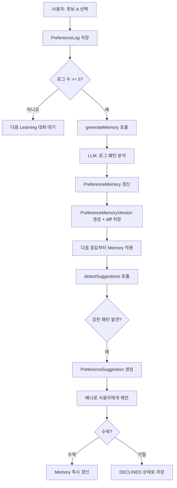

# 05 선호 학습 시스템 (Preference Learning)

## 개요

Preference Learning (선호 학습)은 이 프로젝트의 핵심입니다. 단순히 사용자 정보를 저장하는 것이 아니라, 사용자의 행동 패턴에서 AI 응답 전략의 선호를 학습합니다.

```
학습 루프:
사용자가 선택한다 → 로그가 쌓인다 → LLM이 패턴을 합성한다
→ Preference Memory가 갱신된다 → 다음 응답이 달라진다
```

---

## 학습 루프 전체 흐름



---

## 단계 1: Preference Log 저장

사용자가 Learning Mode에서 후보를 선택하면 `/api/preferences`가 호출됩니다.

저장되는 정보:

```typescript
// PreferenceLog
{
  userId: string,
  messageId: string,
  candidateId: string,
  selectedStrategy: 'STRUCTURED',       // 선택한 전략
  selectedTags: ['MORE_STRUCTURED', 'BETTER_FORMATTING'],  // 이유 태그
  taskType: 'PROGRAMMING',
  domain: 'technology',
  complexity: 'HIGH',
  userQuery: "React 상태관리 어떻게 해?",
}
```

### 이유 태그 (PreferenceTag)

사용자는 왜 그 후보를 선택했는지 태그로 표시합니다.

| 태그 | 의미 |
|---|---|
| MORE_STRUCTURED | 더 구조적인 형식이 좋았다 |
| EASIER_TO_UNDERSTAND | 이해하기 쉬웠다 |
| MORE_PROFESSIONAL | 더 전문적인 느낌이었다 |
| BETTER_FORMATTING | 형식이 잘 정리되어 있었다 |
| BETTER_EXPLANATION | 설명이 더 명확했다 |
| MORE_CONCISE | 더 간결했다 |
| BETTER_REASONING | 논리적 근거가 더 명확했다 |
| FITS_MY_STYLE | 내 스타일에 맞았다 |
| MORE_PRACTICAL | 더 실용적이었다 |
| BETTER_TONE | 말투가 마음에 들었다 |
| MORE_EXAMPLES | 예시가 더 많았다 |
| MORE_DETAILED | 더 자세했다 |

---

## 단계 2: Memory 갱신 임계값

`shouldUpdateMemory()`는 두 값을 비교합니다.

```typescript
const logCount = await prisma.preferenceLog.count({ where: { userId } })
const lastCount = memory?.logCount ?? 0
return logCount - lastCount >= MEMORY_UPDATE_THRESHOLD  // 기본값: 5
```

마지막 Memory 생성 이후 5개 이상의 새 로그가 쌓이면 Memory 재합성을 트리거합니다.

---

## 단계 3: LLM 기반 Memory 합성

`generateMemory()`는 로그들을 LLM(Fast Model)에게 분석시킵니다.

### 입력: 로그 요약

```
[1] Strategy: STRUCTURED, Tags: [MORE_STRUCTURED, BETTER_FORMATTING],
    Task: PROGRAMMING, Domain: technology
[2] Strategy: ANALYTICAL, Tags: [BETTER_REASONING],
    Task: RESEARCH, Domain: general
[3] Strategy: STRUCTURED, Tags: [MORE_STRUCTURED, BETTER_EXPLANATION],
    Task: PROGRAMMING, Domain: technology
...
```

### LLM 분석 프롬프트

```
You are analyzing a user's response preference history to build their Preference Memory profile.

Given a list of preference logs, extract:
- preferredTone: "professional", "friendly", "neutral", etc. or null
- preferredLength: "concise", "medium", "detailed" or null
- preferredStructure: "paragraph", "bullet-points", "step-by-step", "structured" or null
- preferredStrategies: top strategies they select most (array)
- avoidedPatterns: patterns they seem to avoid
- domainPreferences: { domain: weight } where weight 0-1
- strategyWeights: { strategy: score } normalized 0-1
- rawSummary: 2-3 sentence human-readable summary
```

### 출력: PreferenceMemory

```typescript
{
  preferredTone: "professional",
  preferredLength: "detailed",
  preferredStructure: "bullet-points",
  preferredStrategies: ["STRUCTURED", "ANALYTICAL"],
  avoidedPatterns: ["overly casual", "excessive bullet points"],
  domainPreferences: { "technology": 0.85, "general": 0.5 },
  strategyWeights: {
    "STRUCTURED": 0.85,
    "ANALYTICAL": 0.72,
    "CONCISE": 0.30,
    "FRIENDLY": 0.20
  },
  rawSummary: "이 사용자는 기술 관련 질문에서 구조화된 단계별 설명을 강하게 선호합니다. 
              논리적 분석이 포함된 응답을 좋아하며, 지나치게 간결한 답변은 선호하지 않습니다.",
  version: 3,
  logCount: 15
}
```

---

## 단계 4: Memory 버전 관리

Memory가 갱신될 때마다 `PreferenceMemoryVersion`이 생성됩니다.

```typescript
// computeDiff() 예시
diff = [
  {
    field: "preferredTone",
    previousValue: null,
    currentValue: "professional"
  },
  {
    field: "preferredLength",
    previousValue: "concise",
    currentValue: "detailed"
  }
]
```

Prompt Lab의 Memory 탭에서 버전별 변화를 시각적으로 탐색할 수 있습니다.

---

## 단계 5: Ranker에서의 Memory 적용

`rankCandidates()`에서 Memory의 `strategyWeights`가 기본 점수에 더해집니다.

```typescript
// STRUCTURED 전략이 strategyWeights에서 0.85점이라면:
memoryBonus = 0.85 * 0.2  // = 0.17 보정

// preferredStrategies에 포함되어 있다면 추가:
memoryBonus += 0.1         // = 0.27 총 보정

finalScore = min(1, baseScore + memoryBonus)
```

이 수식의 의미: 사용자가 자주 선택한 전략은 동일 품질일 때 더 높은 점수를 받습니다. 처음에는 모든 전략이 동등하게 경쟁하다가, 사용할수록 사용자가 선호하는 전략이 점점 더 자주 선택됩니다.

---

## 단계 6: Adaptive Preference Suggestion

`detectSuggestions()`가 최근 로그에서 강한 패턴을 감지하면 사용자에게 능동적으로 제안합니다.

### 감지 조건

```
최근 5개 이상의 로그 필요
LLM이 패턴 분석 → 3회 이상 일관된 선택이 있어야 제안
```

### 제안 예시

```
"최근 8번의 프로그래밍 질문에서 'STRUCTURED' 전략을 7번 선택하셨습니다.
 이를 기술 질문의 기본 스타일로 설정할까요?"

[수락] [거절]
```

### 저장 구조

```typescript
// PreferenceSuggestion
{
  type: "preferredStrategy",
  currentValue: null,
  suggestedValue: "STRUCTURED",
  rationale: "최근 8번의 PROGRAMMING 질문에서 7번 선택",
  evidenceCount: 7,
  triggerLogIds: ["log-1", "log-2", ...],
  status: "PENDING"  // → ACCEPTED | DECLINED
}
```

---

## Global Learning (전역 학습)

개인 Memory 외에 전체 사용자 데이터를 집계하는 `GlobalPreferenceMemory`가 있습니다.

```typescript
// generateGlobalMemory()
// 모든 PreferenceLog에서 집계:
mostSelectedStrategies: [
  { strategy: "STRUCTURED", count: 142 },
  { strategy: "ANALYTICAL", count: 98 },
  ...
]
domainPreferences: [
  { domain: "technology", strategy: "STRUCTURED", avgScore: 0.87 },
  ...
]
summary: "150개 인터랙션 분석 완료. 최다 전략: STRUCTURED."
```

이 집계 결과는 각 개인의 시스템 프롬프트 `Global Memory Context` 섹션에 주입됩니다. 개인 선호가 아직 충분히 쌓이지 않은 초기 사용자에게 전역 패턴이 보조 역할을 합니다.

갱신 조건: 마지막 집계 이후 50개 이상의 새 로그 (개인은 5개, 전역은 50개).

---

## 학습 효과 비교

| 상태 | Memory | 응답 특성 |
|---|---|---|
| 신규 사용자 (로그 0개) | 없음 | 전략별 동등 경쟁 |
| 초기 (로그 3-9개) | 없음 (임계값 미달) | 여전히 동등 |
| 첫 Memory 생성 (10개+) | v1 | 선호 전략에 약한 보정 |
| 학습 진행 (20개+) | v2-3 | 명확한 전략 선호 반영 |
| 충분한 학습 (50개+) | v5+ | 강한 개인화, 도메인별 차별화 |

---

## 설계 의도: 왜 임계값 방식인가

**즉시 갱신이 아닌 임계값 방식**: 단 하나의 선택으로 Memory가 바뀌면 노이즈에 취약합니다. 사용자가 실수로 다른 후보를 선택했을 때 시스템이 과도하게 반응하지 않도록 5개 임계값을 설정했습니다.

**LLM 기반 합성이지 규칙 기반이 아닌 이유**: 선호 패턴은 복잡합니다. 단순히 "STRUCTURED를 가장 많이 선택했다"는 집계로는 "프로그래밍 질문에서는 STRUCTURED, 일반 대화에서는 FRIENDLY"와 같은 도메인별 차별화를 포착할 수 없습니다. LLM이 전체 맥락을 이해하고 자연어로 요약합니다.
